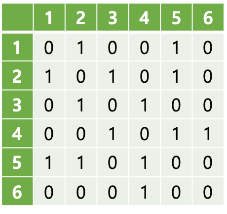

# 그래프

## 도입
전설적인 수학자 레온하르트 오일러는 다음과 같은 문제를 받았다.
> 쾨니히스베르크라는 도시에는 강이 흐르고 있고, 이 강에는 섬이 두 개 있다. 또 이 섬들과 도시의 내륙을 연결하는 7개의 다리가 있다. 이때 이 7개의 다리들을 모두 한 번씩만 건너면서, 처음 시작한 위치로 다시 돌아올 수 있는 방법이 있는가?

{: width="600"}

오일러는 그런 방법이 없다는 것을 수학적으로 증명하기 위해 **그래프**(graph) 이론을 만들게 되었다. 도시와 섬을 점으로, 다리는 그것들을 잇는 선으로 나타낼 수 있다.

{: width="600"}

## 그래프란?
위의 그림과 같이 점과 그 점들을 잇는 선들의 모임을 그래프라고 한다.

그래프에서는 그 점을 **정점**, **버텍스**(vertex), 또는 **노드**(node)라고 부르고, 정점을 잇는 선을 **간선** 또는 **에지**(edge)라고 부른다.

## 그래프의 종류
그래프는 무방향 그래프와 방향 그래프로 나눌 수 있다.

**무방향 그래프**는 쾨니히스베르크의 다리 문제와 같이 한쪽 정점에서 다른 쪽 정점으로 건너갈 수 있고, 그 반대 방향으로도 건너갈 수 있을 때를 의미한다.

한편 **방향 그래프** (또는 유향(有向) 그래프)에서는 간선이 일방통행이기 때문에, 한 정점에서 다른 정점으로 건너갈 수 있다고 해서 반대 방향으로도 건너갈 수 있는 것은 아니다. 방향 그래프에서는 다음과 같이 간선을 화살표로 표시한다.

## 차수와 한붓그리기
어떤 노드의 **차수**(degree)란, 노드와 연결되어 있는 간선의 개수를 의미한다. 예를 들어, 다음 그림에서 1번 노드의 차수는 2, 4번 노드의 차수는 3, 6번 노드의 차수는 1이다.

{: width="300"}

방향 그래프에서는, 노드로 들어오는 화살표(간선)의 개수를 **진입 차수**(in-degree), 노드에서 빠져나오는 화살표의 개수를 **진출 차수**(out-degreee)라고 부른다.

무방향 그래프에서, 차수가 홀수인 노드가 0개 또는 2개일 때만 한붓그리기가 가능하다. 그 이유가 궁금하다면 나중에 한번 곰곰이 생각해 보도록 하자.

## 그래프의 표현
그러면 컴퓨터로 그래프를 어떻게 표현할 수 있을까? 그래프를 다시 보자.

{: width="300"}

우선 `adj`라는 이차원 배열을 만들 것이다. 예를 들어 1번 정점에서 2번 정점으로 갈 수 있다면, `adj[1][2]`를 1로 만든다. 또 1번 정점에서 3번 정점으로 가는 간선은 없다. 따라서 `adj[1][3]`은 0이 된다. 이런 식으로 배열을 채우면 다음과 같은 모양이 될 것이다.

{: width="300"}

이런 형태의 이차원 배열을 **인접 행렬**(adjacency matrix)이라고 부른다. 만약 a번 정점에서 b번 정점으로 갈 수 있는지 확인하기 위해서는 `adj[a][b]`가 0인지 1인지 확인하면 된다.
